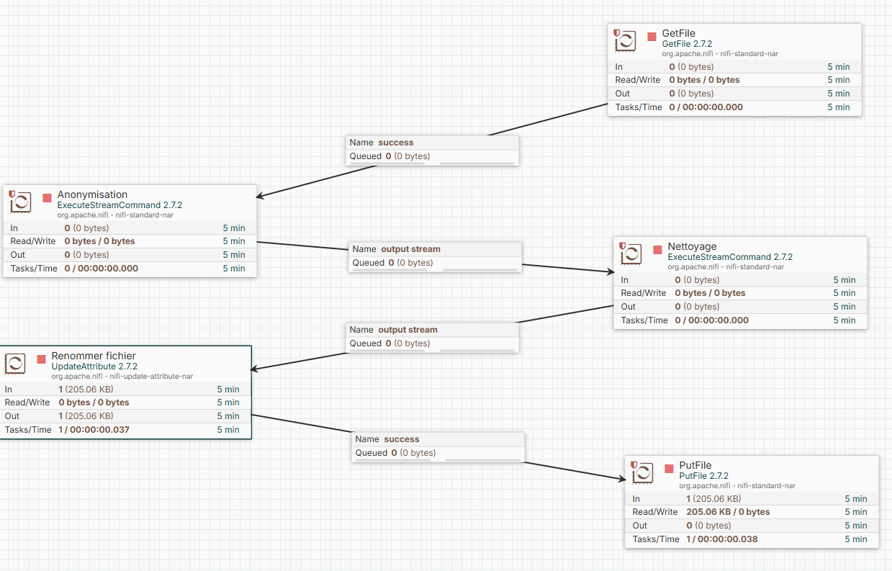

# 4-DAFC : création d'un flux de données sur l'analyse clientèle d'une entreprise

## Auteur : Julien RENOULT - Tom JOUSSET - Béatrice BEAVOGUI
## Promo : SUPINFO Programme Grande École 4ème année 
## Spécialité : Ingénierie Data
### *Date : 23/02/2026*

Dans le cadre de ce projet, nous devions créer un processus de flux de données afin de l'anonymiser, nettoyer puis l'analyser à travers deux outils :
- Apache nifi : pour l'anonymisation et le nettoyage des données par un ETL en utilisant deux scripts python
- Power BI : pour la création du rapport/dashboard avec deux vue d'analyse, une portant sur les bénéfices et de l'autre sur le profil de la clientèle

Nous étions trois à faire ce projet et nous l'avons répartie de la façon suivante :
- Tom JOUSSET : il s'occupait de la création des deux scripts python sur l'anonymisation d'une part et le nettoyage d'autre part
- Béatrice BEAVOGUI : elle s'occupait de la création de l'ETL sur apache nifi en exécutant les deux scripts python
- Julien RENOULT : il s'occupait de la création du rapport sous Power BI afin d'analyser d'une part les bénéfices de l'entreprise et d'autre part le profil du client

Il existe trois dossiers dans ce projet qui répartissent le travail :
- script_python : les deux scripts python utilisées par Apache nifi
- apache_nifi : là où on trouve le flux de données et la capture d'écran de ce schéma
- dashboard : le rapport Power BI analysant les données préparées

# 1ère partie : création d'un ETL sous Apache nifi

Dans cette partie, je vais vous expliquer comment lancer nifi sous docker avec le docker compose dans ce projet.
Je demanderais d'avoir les pré-requis suivants pour pouvoir lancer le docker compose
- [Docker Desktop](https://docs.docker.com/get-started/get-docker/)
- [Git pour Windows](https://git-scm.com/install/windows) pour le bash 
- Rendre exécutable le script *setup_nifi.sh*, pour ce faire, utiliser la commande ci-dessous en vous placant dans le projet (attention c'est du bash, si vous êtes sous windows, exécuter cette commande sous **Git Bash**) :
```bash
chmod +x setup_nifi.sh
```

Maintenant que vous avez respecté les pré-requis, il faut lancer *Docker Desktop* et utiliser la commande ci-dessous :

```bash
./setup_nifi.sh
```

Cela lancera le script bash qui va télécharger l'image nifi, créer les volumes et installer Python et ses librairies (*pandas, faker*). Après qu'il aura tout initialisé, il lancera le conteneur une première fois afin de configurer tout le reste de l'application nifi. À la fin de la première initialisation, le script va ajouter le template du fluw créé qui se trouve dans le dossier *./nifi/mon_flow/flow.json.gz*. Pour finir, il relancera le conteneur afin de prendre ces modifications en compte et le lancer. Attendez-vous à ce que cela dure un peu de temps notamment à cause du téléchargament de l'image liée à nifi. 

Pour ce qui est du flux créé, c'est un flux simple qui contient 5 processeurs. Un premier processeur va aller chercher les données du CSV (**dataset_projet_evaluation.csv**) dans le dossier *./data*. Le deuxième et troisième processeur vont exécuter les deux scripts pythons qui sont dans le dossier *./script_python* (*anonymisation.py, nettoyage.py*). L'avant dernier processeur va renomer le fichier CSV de sortie en ajoutant le préfixe *prepared* et pour finir le dernier processeur va exporter le fichier CSV anonymisé et préparé dans le dossier *./data*. 



# 2ème partie : scripts Python

Pour ce qui est des scripts Python, le premier nommé *anonymisation.py* va mettre en conformité les données dans le cadre du RGPD en supprimant les données trop sensibles et inutiles et anonymiser/pseudonimiser les autres données sensibles. Pour ce qui est d'identifier le client, nous avons choisi de garder l'id du client déjà généré évitant une étape inutile dans la pseudonymisation de nos clients. Pour ce qui est du nom et du prénom, nous les avons supprimé.

Voici une lise des transformations que nous avons faites pour l'anonymisation :
- Suppression de colonnes de données trop sensibles comme la ville, le codePostal, Sexe, etc
- Aggrégation de l'âge par tranche
- Anonymisation du numéro de téléphone, du numéro de carte de crédit et de l'email

Pour ce qui est du nettoyage, nous avons faits les transformations suivantes :
- supprimer doublons via l'id du client
- remplissage des valeurs nulles par une valeur par défaut pour les colonnes catégoriques, la médiane pour les colonnes numériques et par la valeur *False* pour les colonnes booléennes
- création des colonnes *Bénéfices* et *Fidélité*
- filtrage des données pour avoir un bénéfice positif ou nulle et non négatif, un nombre d'achats supérieur à 0 car inutile à analyser ces clients

À la fin de ce traitement, nous avons 888 lignes de données que nous allons analyser soit une perte de 11,2% des lignes par rapport aux données originales ce qui est négligeable. Ce filtrage a été appliquée de sorte d'enlever les clients qui n'ont pas fait d'achats (aucun intérêt les analyser) et les bénéfices négatives qui sont des erreurs de données.

# 3ème partie : rapport Power BI

Comme je l'ai mentionné précédemment, deux onglets ont été créés dans ce rapport. Le premier onglet **Bénéfices réalisés** va analyser, comme son nom l'indique, les bénéfices réalisés de l'entreprise (Chiffre d'Affaire autrement dit) dans le monde. L'objectif était de pouvoir déduire les produits les mieux vendus dans le monde pour chaque pays, afin de faire un point sur ce qui l'apporte le plus. Le deuxième nommé **Clientèle** va enrichir cette analyse en regardant le profil du client (Âge, Entrprise/Particulier, AvisClient, etc). Grâce à ces deux onglets, cela permettra de mettre en place des actions plus ciblées sur les clients en proposant des produits plus adaptées à leurs besoins selon différents critères.
